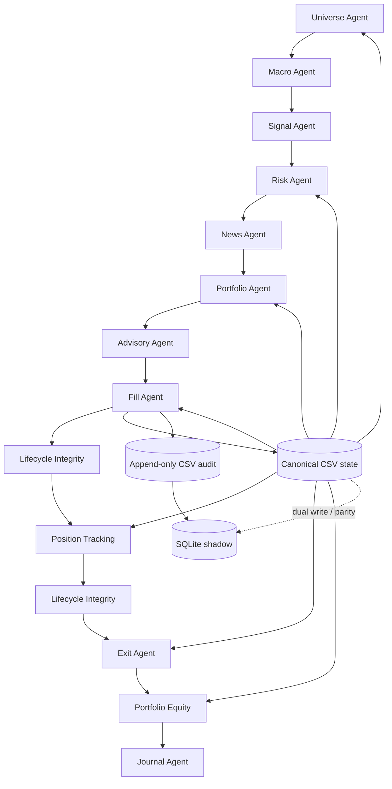
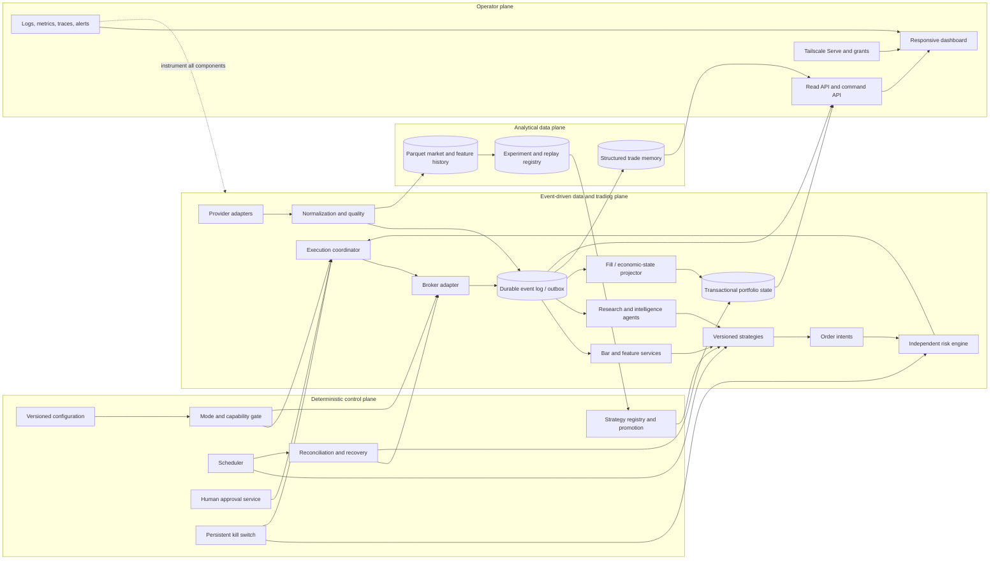

# Phase 0 Target Architecture

Assessment date: 2026-08-16

## Architecture decision

Adopt a hybrid architecture:

- **Deterministic control plane:** configuration, modes, scheduling, strategy lifecycle, approvals, reconciliation, recovery, backups, and acceptance gates.
- **Event-driven trading/data plane:** quotes, trades, completed bars, market events, signals, order intents, risk decisions, broker updates, fills, position marks, and alerts.
- **Single economic projector:** Fill/economic-state service remains the only component allowed to mutate positions, cash, realised Profit and Loss, and processed-fill evidence.

This extends the present governance rather than replacing it.

## Current architecture



Strengths are deterministic sequencing, one canonical run ID, one economic mutator, lifecycle gates, idempotent fill evidence, and implemented reconciliation/parity tooling. The checked-in artifact set does not currently pass the nightly checklist or parity, and final checks do not fail a run. Other limitations are batch-only scheduling, file handoffs, equity-centric identifiers, warning-only staleness, no broker lifecycle, and no independent portfolio pre-trade risk.

## Hybrid target



## Non-negotiable invariants

1. Strategies and reasoning agents cannot mutate economic state or bypass Risk.
2. Only the economic projector applies fills and controlled cash adjustments.
3. Every external message may be delivered more than once; consumers must be idempotent.
4. An order cannot be submitted without a current risk decision bound to the exact order, data snapshot, account snapshot, limits version, mode, and expiry.
5. Unknown, stale, malformed, contradictory, or sequence-gapped critical market data blocks new risk approvals.
6. A closed position is historically immutable except through a documented correcting event.
7. Mode 6 has no active credential or deployable submission path during the current programme.
8. Dashboard reads cannot mutate state. Privileged commands use a separate authenticated and audited path.
9. Learning creates candidates; it cannot edit production code or promote itself.
10. Broker, canonical portfolio, and audit evidence must reconcile before a new live-capable session begins.

## Event model

Use a small transport-neutral envelope inspired by CloudEvents. CloudEvents requires stable `id`, `source`, `type`, and `specversion`, and permits identical source/ID pairs to be recognized as duplicates. [CloudEvents specification](https://github.com/cloudevents/spec/blob/main/cloudevents/spec.md)

Required project fields:

- `event_id`, `event_type`, `schema_version`
- `source`, `subject`, `occurred_at`, `ingested_at`
- `correlation_id`, `causation_id`, `run_id`
- `instrument_id`, `account_id`, `strategy_version_id` where relevant
- producer sequence and durable log offset
- idempotency key
- data-quality classification
- payload checksum and raw-payload reference
- immutable payload

Initial transport should be a transactional database event table plus outbox/consumer checkpoints. Do not introduce Kafka merely to label the architecture event-driven. Reassess transport when measured throughput, multiple hosts, independent scaling, or retention needs exceed the single-host design.

## Instrument abstraction and calendars

### Identity

Use an immutable internal `instrument_id`. Ticker is a time-versioned alias, never a primary key. OpenFIGI maps external identifiers across venue, composite, and share-class levels and notes that tickers can change after corporate actions. [OpenFIGI API](https://www.openfigi.com/api/documentation), [OpenFIGI features](https://www.openfigi.com/about/features)

Store:

- internal ID, asset class, display name, lifecycle status
- currency, venue, primary venue, ISO 10383 MIC
- tick and lot rules, multiplier, price precision
- provider/broker aliases with effective-from/to dates
- source and revision provenance

ISO 10383 provides the maintained venue-code standard. [ISO 10383 MIC list](https://www.iso20022.org/market-identifier-codes)

### Asset-specific extensions

| Asset | Required extension fields |
|---|---|
| Equity/ETF | listing/share class, corporate-action policy, settlement cycle, shortability |
| Index | calculation source, tradability flag, constituents/version provenance |
| Option | underlying ID, expiry, strike, put/call, style, multiplier, exercise and settlement method |
| Future | product/root, specific contract, last trade, first notice, delivery/settlement, multiplier, tick schedule |
| FX | base/quote, tenor, settlement convention, pip/tick, trading session |
| Commodity-linked security | the actual listed security/contract plus underlying exposure description |

Continuous futures series may support research but must never resolve directly to an executable order.

### Calendar service

Calendars are instrument/venue data, not static application constants. Store named timezone, sessions, breaks, auctions, early closes, holidays, trade date, settlement date, and expiry/notice events with a source version. IANA timezone data changes with political decisions; use named zones and maintain the deployed database. [IANA Time Zone Database](https://www.iana.org/time-zones) CME notes that holiday hours can change and may be finalized near the event. [CME trading hours](https://www.cmegroup.com/trading-hours.html)

## Market-data architecture

### Capability adapters

Separate interfaces for:

- reference data and symbol mapping
- historical trades, quotes, and bars
- live trades and quotes
- corporate actions
- news and economic events
- options chains, implied volatility, and Greeks
- calendars and sessions

Each provider adapter returns raw provenance plus a normalized domain object. Strategy code depends on normalized data, never provider SDK types.

### Time and quality

Exchange-grade schemas distinguish event time, capture/receive time, venue sequence, publisher, instrument ID, and quality flags. [Databento TBBO schema](https://databento.com/docs/schemas-and-data-formats/tbbo) Nasdaq TotalView is a sequenced feed with a book-retransmission facility. [Nasdaq TotalView-ITCH](https://www.nasdaqtrader.com/content/technicalsupport/specifications/dataproducts/NQTVITCHSpecification.pdf)

Normalized observations therefore need:

- provider, dataset, venue, entitlement/feed class
- provider symbol and internal instrument ID
- event, provider-receive, and local-ingest timestamps
- sequence/revision and correction status
- live/delayed/replayed classification
- schema version and quality flags
- raw record reference or checksum

Freshness policies are versioned by data class, instrument, session, and mode. Quotes, intraday bars, daily bars, news, and reference data use different thresholds. Market-closed data is not automatically stale; an absent expected session update is. A sequence gap triggers recovery from a snapshot or replay and blocks executable decisions until the state is coherent.

## Broker-neutral execution

### Adapter interface

Every adapter should expose capability discovery plus:

- account, balances, buying power, margin
- positions and executions
- open/all orders and status requests
- submit, cancel, replace where supported
- streaming order/execution updates
- health, clock, rate-limit, and reconnect state

The internal lifecycle should follow FIX-like execution semantics rather than copying one broker’s labels. FIX explicitly models acknowledgements, partial fills, cancel/replace races, rejections, execution corrections, busts, and terminal states. [FIX Order State Changes](https://www.fixtrading.org/online-specification/order-state-changes/)

Keep distinct IDs for internal command, client order, broker order, venue order, parent order, child order, and execution. Persist the command and idempotency key before submission. On ambiguity, query and reconcile; never blindly resend.

### Rollout order

1. Fake deterministic adapter for unit and replay tests.
2. Read-only paper account sync and reconciliation.
3. Paper submission with explicit approval and kill switch.
4. Shadow-live intent generation with no broker submission.
5. Human-approved live support only after later acceptance.
6. Autonomous live remains locked and deferred.

Paper results cannot be treated as live execution evidence. Alpaca says paper trading omits market impact, information leakage, latency slippage, queue position, and real displayed-size constraints. [Alpaca paper trading](https://docs.alpaca.markets/us/docs/paper-trading)

## Execution modes

Represent modes as immutable capability sets:

| Mode | Data clock | Broker read | Broker submit | Capital | Approval |
|---|---|---:|---:|---|---|
| 0 Analysis | chosen snapshot | no | no | none | none |
| 1 Historical Backtest | historical | no | no | simulated | config approval |
| 2 Market Replay | replay clock | no | no | simulated | config approval |
| 3 Paper Trading | live | paper only | paper only | simulated | policy-defined |
| 4 Shadow Live | live | optional read-only | no | hypothetical | none to submit |
| 5 Human-Approved Live | live | live | live after approval | restricted real | mandatory per order/batch |
| 6 Autonomous Live | live | locked | locked | unavailable | future decision only |

Mode changes require an authenticated transition record, reason, configuration hash, validation, audit event, and safe restart. Paper and live credentials/endpoints must be different. Capability checks occur inside the broker adapter as well as the coordinator so configuration mistakes fail closed.

## Independent risk engine and kill switch

The order path is:

`OrderIntent → Data Quality Gate → Instrument/Session Gate → Trade Risk → Portfolio Risk → Account/Margin Risk → Mode/Approval Gate → Broker Adapter`

Controls include price collars, order size/value, duplicate commands, message throttles, liquidity/spread, trading hours, pending-order exposure, position and asset-class limits, leverage, concentration/correlation, sector/FX exposure, daily/weekly loss, drawdown, margin, event/news risk, and asset-specific option/futures constraints.

SEC market-access guidance emphasizes automated pre-trade rejection for capital/credit, price, size, and duplicate-order limits. [SEC Rule 15c3-5 guidance](https://www.sec.gov/rules-regulations/staff-guidance/trading-markets-frequently-asked-questions/divisionsmarketregfaq-0) ESMA’s 2026 briefing expects price collars, order value/volume limits, message limits, execution throttles, cumulative parent/child checks, non-overridable hard blocks, independent risk monitoring, periodic testing, and kill functionality. [ESMA 2026 supervisory briefing](https://www.esma.europa.eu/sites/default/files/2026-02/ESMA74-1505669079-10311_Supervisory_Briefing_on_Algorithmic_Trading_in_the_EU.pdf)

The kill switch is a persisted latch, not a UI boolean. Triggering it must atomically block new approvals/submissions, request cancellation of eligible open orders, enter safe mode, emit a critical event, and notify operators. Restart does not clear it. Reactivation requires independent identity, reason, reconciliation, and deliberate reset.

## Persistence

| Domain | Near-term | Scale trigger |
|---|---|---|
| Economic state/orders/risk | SQLite transactional authority after parity gate | PostgreSQL when concurrent services, multi-host operation, or high availability is required |
| Audit/events | Append-only SQLite table with offsets, outbox, hashes, checkpoints | Durable stream platform only on demonstrated throughput/distribution need |
| Market/feature history | Immutable partitioned Parquet | Object storage/catalog if volume requires it |
| Experiments/models | Versioned metadata DB plus immutable artifacts | Dedicated registry only when workflow complexity demands it |
| Dashboard reads | Read models/views | Read replica/cache if measured load requires it |

SQLite WAL allows readers alongside a writer but still has one writer and assumes one machine. [SQLite WAL](https://www.sqlite.org/wal.html) PostgreSQL MVCC is appropriate when multiple sessions must read/write concurrently. [PostgreSQL MVCC](https://www.postgresql.org/docs/current/mvcc-intro.html) Parquet is column-oriented and suited to compressed analytical history, not mutable order state. [Apache Parquet](https://parquet.apache.org/)

The SQLite authority gate requires one transaction for fill deduplication, cash movement, position mutation, economic event, and outbox message, followed by proven backup/restore and rollback behavior.

## Learning and trade memory

Each trade stores an immutable decision package:

- strategy/code/parameter versions
- hypothesis and rationale
- feature and data snapshot IDs
- market, volatility, macro, news, and event regimes
- expected return/risk/confidence
- order intent, risk decision, approvals, and mode
- timestamps, spread, latency, fills, fees, slippage, and execution benchmark
- maximum favourable/adverse excursion
- exit decision, holding period, net return, benchmark return
- operator notes and post-trade observations

Learning runs offline over immutable memory. It may propose parameter, weighting, selection, filter, execution, or sizing challengers. It may not edit production code, change active limits, or self-promote.

## Strategy lifecycle and champion/challenger

Lifecycle:

`Experimental → Backtested → Validated → Paper → Shadow Live → Approved → Live Eligible → Suspended → Retired`

Every transition is an append-only decision referencing immutable evidence. Requirements include chronological out-of-sample and walk-forward results, point-in-time inputs, trial count, multiple-testing correction, regime/asset stability, parameter-neighbourhood sensitivity, costs/market impact, replay/fault tests, paper/shadow operational evidence, and Sentinel acceptance.

The Deflated Sharpe Ratio adjusts for non-normal returns and selection across many trials. [Bailey and López de Prado](https://papers.ssrn.com/sol3/papers.cfm?abstract_id=2460551) White’s Reality Check tests whether the best result found in a specification search genuinely outperforms a benchmark after data snooping. [White, *Econometrica*](https://doi.org/10.1111/1468-0262.00152)

Champion and Challenger use the same frozen evaluation windows and assumptions. A Challenger may generate paper or shadow intents but cannot replace the Champion. Promotion, rejection, suspension, and rollback record decision-maker, evidence, rationale, and limits.

## Dashboard and Tailscale deployment

### Application boundaries

- Read API exposes projections only; it cannot call the economic projector.
- Command API owns kill, reset, and human approvals with separate authorization and audit.
- Backend binds to `127.0.0.1` on the Mac mini.
- Tailscale Serve terminates HTTPS and proxies the loopback service into the tailnet.
- Tailscale grants permit an explicit operator group and deny other access by default.
- Funnel is prohibited.

Tailscale documents Serve as private tailnet sharing and Funnel as public internet exposure. [Tailscale Serve](https://tailscale.com/docs/reference/tailscale-cli/serve), [Tailscale Funnel](https://tailscale.com/kb/1223/funnel) Grants implement deny-by-default least privilege. [Tailscale grants](https://tailscale.com/docs/reference/syntax/grants) Serve identity headers are safe only when the backend cannot be reached directly, so loopback binding is required. [Serve identity headers](https://tailscale.com/docs/features/tailscale-serve)

### Mobile design

The iPhone first view prioritizes equity, daily Profit and Loss, open risk, positions, critical alerts, execution mode, system health, kill status, and recent activity. Detailed charts and journals use progressive disclosure. All values display as-of time and freshness.

### Read-only dashboard wireframes

Desktop:

```text
┌ Investing Agents ─ Mode 0: Analysis ─ DATA HOLD ─ Kill: CLEAR ─ as of 08:30:12 ┐
│ Equity £102,418 │ Day P&L -£32 │ Open risk 0.8% │ Cash £41,200 │ Health DEGRADED │
├ Equity / drawdown / exposure chart ──────────────┬ Risk and data quality ───────┤
│                                                  │ stale feeds 1 · gaps 0       │
├ Positions: instrument · qty · mark · P&L · risk ┼ Critical alerts               │
│ read-only rows with source and freshness         │ reconciliation delta -£32    │
├ Recent activity: signals · risk blocks · fills · reconciliation · backups ──────┤
│ [Overview] [Positions] [Risk] [Activity] [Journal] [System]                      │
└ No trade, approval, kill-reset, or economic-mutation control in the read API ────┘
```

iPhone:

```text
┌ Investing Agents ─ 08:30 ┐
│ Mode 0 · DATA HOLD       │
│ Kill CLEAR · DEGRADED    │
├ Equity £102,418          │
│ Day P&L -£32 · Risk 0.8% │
├ Equity / drawdown spark  │
├ Positions (3)        ›   │
│ SPY  £…  P&L …  fresh    │
├ Critical alerts (1)  ›   │
│ Unexplained delta -£32   │
├ Recent activity      ›   │
└ Home · Pos · Risk · Alerts · More ┘
```

`DATA HOLD`, mode, kill state, system health, and freshness remain pinned in every view. Any future approval or kill command belongs to the separately authenticated command API and is not implied by these read-only wireframes.

## Observability and operations

Use structured JSON logs, metrics, traces, and critical events sharing run/correlation IDs. Minimum metrics include provider freshness/gaps, event lag, decision duration, broker round-trip latency, failed/rejected orders, risk blocks, reconciliation/parity failures, queue depth, agent duration, database health, drawdown, and strategy drift.

Supervise long-running services through the host service manager. Scheduling is explicit for pre-market preparation, open, periodic scans, bar completion, risk/position monitoring, close, end-of-day reconciliation, journal, learning, and backups. Prefer events to high-frequency polling where the provider offers a stream.

## Testing and acceptance architecture

### Test layers

1. Unit tests for deterministic finance, instruments, calendars, modes, risk, and state transitions.
2. Contract tests for every provider and broker adapter against recorded schemas.
3. Integration tests using fake clock, fake market feed, fake broker, and temporary storage.
4. Deterministic market replay through signal, risk, order, fill, and reconciliation.
5. End-to-end paper tests with no live credentials present.
6. Fault injection: stale/malformed/contradictory data, feed gaps, disconnects, duplicate and out-of-order events, partial fills, rejects, corrections, database failure, process interruption, and clock/calendar boundaries.
7. Concurrency and property tests for idempotency, invariants, risk monotonicity, and closed-state immutability.
8. Recovery drills proving backup restore, broker resync, event replay, and kill-latch persistence.

Forge implements tests with the feature. Sentinel independently defines and executes acceptance criteria and alone records acceptance. No component is live-eligible with unresolved critical/high defects, reconciliation failures, stale-data bypasses, unexplained mutation, or untested rollback.

## Deliberately deferred

- Autonomous live trading activation
- Uncontrolled self-modifying code or models
- Public-internet dashboard exposure
- High-frequency or colocated trading objectives
- Kafka, Kubernetes, microservices, time-series databases, or PostgreSQL without measured need
- Direct options/futures/FX execution before instrument, calendar, margin, and asset-specific risk controls
- Dashboard-based economic mutation before the separate command-control security model is accepted
