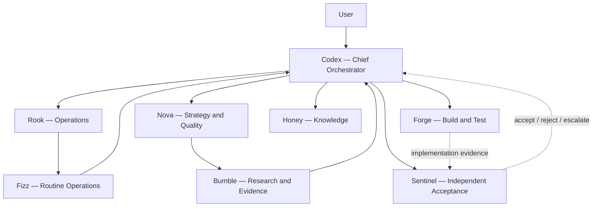

# Phase 0 Team Log

Assessment date: 2026-08-16
Programme: Investing Agents

## Buzz setup status

Requested Buzz channel name: **Investing Agents**

Status: **not created in this run**.

Native Buzz channel-management tooling was not available in the execution environment. The team roster and operating model are recorded here for continuity, but this document does not claim that a channel, membership, hierarchy, or model assignment was created or changed.

No duplicate development agents were added inside the repository. Repository trading agents remain software components of the trading platform; Buzz team members remain the development and supervisory team.

Existing hierarchy, escalation routes, and model assignments should be preserved. Model assignments were not visible or editable in this run, so no changes are asserted or recommended.

## Team hierarchy and responsibilities

| Team member | Role | Primary responsibilities | Escalates to | Independence rule |
|---|---|---|---|---|
| Codex | Chief Orchestrator | Architecture, decomposition, delegation, integration, decisions, gate presentation | User | Owns programme decisions; does not self-certify specialist acceptance |
| Rook | Operations, Systems & Delivery Lieutenant | Runtime reliability, scheduling, Mac mini services, Tailscale, monitoring, backups, recovery, operational readiness | Codex | Operational evidence must be reproducible and reviewable by Sentinel |
| Nova | Strategy, Intelligence & Quality Lieutenant | Strategy architecture, agent/service boundaries, learning methodology, Champion/Challenger design, reasoning-quality review | Codex | Does not promote a strategy without independent evidence and approval |
| Bumble | Research & Evidence Analyst | Primary-source research on market data, brokers, identifiers, storage, risk, validation, dashboards, and provenance | Nova for research quality; Codex for architectural implications | Separates verified fact from recommendation and cites sources |
| Honey | Communications & Knowledge Steward | Assessments, architecture records, operating procedures, decision logs, summaries, and documentation consistency | Codex | Does not present requested or planned work as completed |
| Fizz | Routine Operations Assistant | Inventories, repeatable checks, housekeeping, monitoring, evidence collection, low-complexity validation | Rook | Does not make architecture or acceptance decisions |
| Forge | Coding, Build & Test Specialist | Implementation, refactoring, adapters, APIs, storage, dashboard, unit/integration tests | Codex; collaborates with Rook/Nova | Cannot accept its own implementation |
| Sentinel | Validation & Acceptance Specialist | Independent acceptance criteria, regression, risk-control verification, fault tests, evidence review | Codex; direct escalation for unsafe behavior | Acceptance remains independent of Forge |

## Escalation routes

Critical safety findings may be escalated directly to Codex without waiting for the normal reporting chain. Sentinel rejection blocks the relevant gate. A strategy, broker, risk, mode, storage, or dashboard component with unresolved critical/high safety defects cannot be advanced by schedule pressure.

## Phase 0 work record

| Workstream | Accountable role | Recorded outcome |
|---|---|---|
| Programme orchestration | Codex | Repository audit and architecture-assessment programme initiated; final integration remains with Codex |
| Operations/deployment lens | Rook | Completed the operational audit, including Mac mini runtime/deployment, scheduling, Tailscale, observability, backup/recovery, and operational-readiness gaps |
| Strategy/learning lens | Nova | Completed the strategy audit, including deterministic/reasoning boundaries, multi-asset strategy needs, governed learning, validation, and Champion/Challenger promotion |
| Primary-source research | Bumble | Completed research covering broker-neutral/FIX-like order state, event envelopes, data provenance/freshness, instrument identity/calendars, risk controls, storage, Tailscale, paper limitations, and strategy validation; recommendations are incorporated into `target_architecture.md` and `implementation_roadmap.md` |
| Narrow control-plane patch | Forge | Corrected the dependency order to Universe → Macro → Signal → Risk → News → Portfolio; changed Fill and Position Tracking to use the canonical pipeline run ID; added focused regression tests; updated the README sequence |
| Independent validation | Sentinel | **ACCEPT** for the narrow Forge patch: the full suite passed 84 tests, and a disposable subprocess run proved the corrected order and one canonical run ID across run-scoped artifacts. The run exited 0, but its summary showed zero fills/opened/closed alongside `-32.00` cash/equity deltas and zero validation failures; acceptance therefore does not cover reconciliation cleanliness, finalization semantics, or the wider target architecture |
| Assessment pack | Honey | Created `repository_audit.md`, `target_architecture.md`, `implementation_roadmap.md`, and this team log |
| Routine inventory | Fizz | Completed final read-only evidence collection: 84 tests, bytecode compilation, and diff checks passed; the repository text scan found no secret-pattern matches; nightly checklist, event-log validation, and CSV/SQLite parity retained the same known baseline failures with no new regression |

## Verified Phase 0 facts

- The repository is advisory-only and has no broker submission path.
- The deterministic governance core is valuable and is recommended for retention.
- Forge’s narrow dependency-order/run-ID patch was accepted by Sentinel.
- Acceptance evidence was 84 passing tests plus a disposable subprocess proof of canonical run-ID propagation.
- The disposable full run exited 0 but reported zero fills/opened/closed with `-32.00` cash/equity deltas and zero validation failures; this is Phase 1 hardening evidence, not clean-reconciliation evidence.
- The checked-in event CSV is missing; the nightly checklist and SQLite parity currently fail.
- Success is recorded before reconciliation/parity, and those finalization failures are currently advisory/swallowed rather than fail-closed.
- Fizz's final evidence run found no new regression beyond those documented baseline failures.
- Native Buzz setup was unavailable, so the requested channel was not created.
- No repository agent was added merely to replicate a Buzz role.
- No runtime code or README change is part of Honey’s assessment-pack scope.
- Live trading, live credentials, public dashboard exposure, and autonomous activation remain deferred.

## Required team outputs by next phase

### Codex

- approve or revise Phase 0 decisions
- resolve ownership of existing uncommitted changes
- establish the decision and acceptance record for Gate 0
- sequence Phase 1 work without combining unrelated high-risk changes

### Rook

- Mac/Linux clean-machine bootstrap and supervised-service design
- backup/restore and interrupted-run recovery drills
- scheduler and observability requirements
- Tailscale Serve/grants deployment plan with no Funnel

### Nova

- deterministic versus reasoning-agent responsibility map
- strategy lifecycle, Champion/Challenger, trade memory, and governed learning requirements
- per-asset validation and risk implications

### Bumble

- vendor/broker comparison only when concrete entitlement, asset, geography, latency, and budget requirements are known
- continue preserving source date, provenance, fact/recommendation separation, and provider limitations

### Honey

- reconcile README, roadmap, SQLite design, testing, and runbook only after decisions are approved
- maintain architecture decision records, operating procedures, and gate summaries

### Fizz

- repeatable inventories for tracked runtime files, stale docs, test counts, schema ownership, and backup evidence
- routine health/checklist execution under Rook’s procedures

### Forge

- implement one bounded work package at a time behind tests
- preserve Fill mutation authority and rollback paths
- deliver code, migrations, unit/integration tests, and implementation evidence to Sentinel

### Sentinel

- define acceptance criteria before Forge completes each high-risk package
- independently test stale-data blocks, modes, risk, kill switch, idempotency, recovery, reconciliation, concurrency, and access boundaries
- issue explicit accept/reject results with unresolved defects

## Communication protocol

1. Work item starts with owner, scope, dependencies, expected evidence, rollback, and acceptance owner.
2. Critical/high safety issues are reported immediately.
3. Research claims cite primary sources where practical and label recommendations.
4. Implementation updates distinguish “implemented,” “tests passing,” and “accepted.”
5. Honey records decisions only after Codex/user approval.
6. Sentinel acceptance is a separate event from Forge completion.
7. No team member reports Buzz or external-system changes that tooling did not actually perform.
